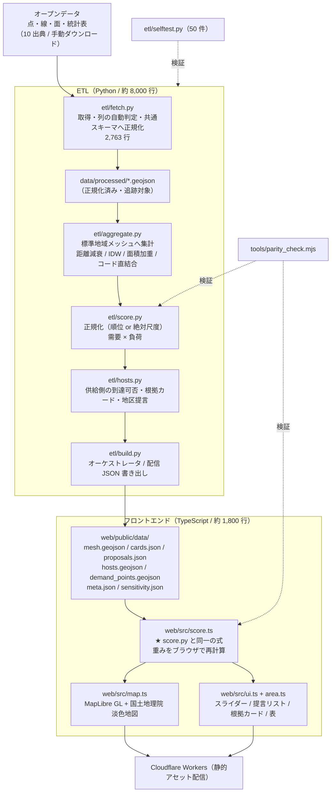

# calmgap-tokyo — プロジェクト総合レビュー兼設計監査レポート

| | |
|---|---|
| 監査日 | 2026-07-31 |
| 対象 | `/Users/hiroaki/Dev/calmgap-tokyo`（ブランチ `claude/continue-session-vsfetr`） |
| 最終コミット | `0a9dfc5 実データが揃った時点の偏りと不透明さを洗い出す`（2026-07-27） |
| 作業ツリー | **36 ファイル変更・7 ファイル未追跡（+28,744 行）が未コミット** |
| 公開先 | https://calmgap-tokyo.hiroaki-kuwabara.workers.dev （**稼働確認済み・ローカル最新ビルドと一致**） |
| 監査者 | Claude Opus 5（Claude Code） |

この文書は、**このリポジトリを初めて見る人（人間・他の AI を問わず）** が設計と現況を
理解し、レビューできるように書いてある。推測ではなく、コード・文書・生成物・
実行結果を根拠にしている。原典より新しい実測値を採った箇所は明示した。

---

## 0. 監査の方法と、その場で確認した事実

### 0.1 実際に走らせたもの

| コマンド | 結果 | 備考 |
|---|---|---|
| `python -m etl.selftest` | ✅ **50 件すべて通過** | 文書は 45 件と書いており実数と食い違う（下記 F-3） |
| `node tools/parity_check.mjs` | ✅ **全 9,507 メッシュで乖離 0.000e+0** | Python↔TypeScript のスコア一致 |
| `npx tsc --noEmit`（`web/`） | ✅ **型エラー 0** | |
| 公開 URL の実表示 | ✅ **正常**（コロプレス描画・提言リスト・凡例・統計値） | 下記 0.3 |
| `curl .../data/meta.json` | ✅ `generated_at` がローカル生成物と一致 | デプロイは最新 |

### 0.2 生成物から独立に検算した数値

`web/public/data/mesh.geojson`（実データ 10/10、生成 2026-07-31T02:31:13Z）を直接集計した。

| 項目 | 実測 | 文書の記載 | 判定 |
|---|---|---|---|
| メッシュ数 | 9,507 | 9,507 | 一致 |
| 到達不可メッシュ | **1,058（11.13%）** | 1,057（11.1%） | **1 件ズレ** |
| 上位 50 のうち到達不可 | 2 | （画面表示 2） | 一致 |
| 上位 20 の区内訳 | **千代田 8 / 豊島 7 / 文京 4 / 新宿 1** | 千代田 9 / 豊島 7 / 文京 3 / 新宿 1 | **1 件ズレ** |
| 渋谷駅前（5339358633）の順位 | 519 / 9,507 | 519 | 一致 |
| ホスト施設 | 1,541（区民センター 530・児童館 501・図書館 247・出張所 160・文化施設 76・公園管理施設 27） | 1,541 | 一致 |
| 配信サイズ | mesh.geojson 6.4MB（brotli 812KB）/ demand_points 4.3MB | — | 実測 |

**1 件ズレの原因は既知の `issues.md` B4（用途地域の面積加重平均が GEOS のバージョン差で
4 桁目から変わる）とみられる。** 提言の中身は動いていないが、**文書の数値と生成物の数値が
一致していることを検査する仕組みが無い**ことは、この監査での新規指摘である（F-3）。

### 0.3 公開サイトの実表示

3 カラム（操作パネル／地図／提言リスト）が成立し、国土地理院淡色地図の上に
9,507 区画のコロプレスが描かれ、提言リストの第 1 位「豊島区 池袋・北池袋周辺」が
実数入りの根拠文（事業所 49 件・定員計 403 人・池袋駅 2,364,011 人/日・商業地域・
推定騒音 72.8dB・緑被覆なし・徒歩圏の公共施設 5 件）を表示している。
コンソールエラーなし。**デモとして成立している。**

### 0.4 この監査で新たに見つかった不整合（リポジトリの `issues.md` に無い項目）

| ID | 内容 | 深刻度 |
|---|---|---|
| **F-1** | **23 区化以降の全作業（+28,744 行）が未コミット。** `git log` の最終コミットは 2 区時点（07-27）で、A9・A10 の是正、`etl/geocode.py`、`web/src/area.ts`、`web/wrangler.jsonc`、`docs/handoff-hosts.md`、`docs/operation-idea.md` がすべて作業ツリーにしか無い。`web/public/data/` は追跡対象なので `git checkout -- web/public/data/` を実行すると**現在の公開データが 2 区時点へ巻き戻る** | **Critical** |
| **F-2** | **画面の説明文が正規化方式を誤って説明している。** `web/src/ui.ts` の `renderMethodology()` が「各レイヤーは対象地域内のパーセンタイル順位で 0〜1 に正規化しています」と断言するが、騒音と用途地域は絶対尺度（`AbsoluteScale`）である。`issues.md` B2 は「画面はまだこの区別を出していない」と書いているが、実際は**区別が無いのではなく逆のことを書いている** | **High** |
| **F-3** | **文書中の数値が生成物と自動照合されていない。** 到達不可 1,057 / 1,058、上位 20 の区内訳、`selftest` 45 件 / 50 件、`handoff-hosts.md` の「公開中（**未反映**）」（実際は反映済み）など、複数箇所が実物と食い違う。「過去の数字を引用しないこと」を CLAUDE.md が強く戒めているのに、**その戒めを機械的に守る仕組みが無い** | **High** |
| **F-4** | **`sensitivity.json` にビルドとの整合性の担保が無い。** `--sensitivity` を付けたときだけ書かれるため、現物は `mesh.geojson` より 1 時間半前の別ビルドで生成されている（ファイル更新時刻 10:05 対 11:31）。JSON 内に `generated_at` が無く、画面は無言で古い感度分析を出す | Medium |
| **F-5** | **`proposals.json`（6 件）と画面の提言リスト（上位 40 区画から最大 12 件）で件数と顔ぶれが違う。** 静的書き出しは上位 20 区画（`TOP_N_CARDS`）から、画面は上位 40 区画から束ねている。CLAUDE.md が「提言は 8 件」と書いているのは後者で、資料添付用の JSON は 6 件 | Medium |
| **F-6** | **`meta.json` が実際には使っていない出典を 15 件配信している。** ODPT・不動産情報ライブラリ・鉄道騒音・手帳交付状況・既存カームダウンスペースは未使用（レイヤーは 10）。しかも `sources` は画面のどこにも描画されていない（`renderMethodology` は `components` だけを出す） | Low |
| **F-7** | **CI が無い**（`.github/` 無し）。`selftest` と `parity_check` と `tsc` は手で叩く運用。CLAUDE.md が「変更したら必ず通す」と書いている検証が、機械的には強制されていない | Medium |

---

## 1. プロジェクト概要

### 1.1 何を作ろうとしているのか

**東京都は次にカームダウン・クールダウンスペースをどこに設置すべきか**を、
オープンデータだけから算出し、根拠つきで提言する**行政・事業者向けの分析ツール**。

出力は 3 つ。

1. 東京 23 区・250m メッシュ 9,507 区画の**設置優先度コロプレス**
2. 上位区画を隣接単位で束ねた**地区ごとの提言リスト**（「豊島区 池袋・北池袋周辺」）
3. そのまま予算会議に出せる**実数入りの根拠カード**

### 1.2 誰のどんな課題か

| | |
|---|---|
| **エンドの受益者** | 感覚過敏（発達障害・精神障害・PTSD 等）のある人。都市の音・光・匂い・混雑で過負荷になり、一時退避できる場所を必要とする |
| **本ツールの利用者** | **配置を決める行政・鉄道事業者・施設運営者**（当事者本人ではない） |
| **使う瞬間** | 「次の一箇所をどこに作るか決めるとき」 |
| **課題** | 整備が施設単位の個別事例として進んでおり、都全体で需給を俯瞰して配置優先度を分析した公開資料が確認できない。つまり**どこから手を付けるべきかを示す材料が無い** |

### 1.3 社会的背景

- 障害者差別解消法の改正（2024 年 4 月〜）で、民間事業者にも合理的配慮の提供が義務化
- 港区役所・都立中央図書館・一部の駅などで個別の設置事例が公表されている
- しかし整備順序の根拠は示されていない

### 1.4 理念（コードと文書から読み取れるもの）

このプロジェクトの理念は、README よりも **`CLAUDE.md` と `docs/issues.md` に濃く現れている**。

1. **もっともらしく見えることが、そのまま発見を妨げる。** A29 用途地域で列名の推測が
   外れ、全件 NaN のまま既定値が全メッシュに乗り、**ビルドもテストも成功と表示された**。
   この失敗が設計思想そのものになっている（「列名の決め打ちを全レイヤーで禁止」）
2. **取りこぼしても混入させない。** 判断できないデータは落とし、過小計上であることを明記する
3. **不利な結果を隠さない。** 感度分析で「特別支援学校を外すと上位 10 件が 0% しか残らない」
   という自作品に不利な数値を、README・methodology・issues の 3 箇所に書いている
4. **モデルが計算していないことを主張しない。** かつて提言の見出しを施設名にしていたが、
   「施設の適性を測る構成要素が一つも無い」ことを理由に地区名へ差し替えた（A10）

### 1.5 提供価値

| 価値 | 具体 |
|---|---|
| **絞り込み** | 9,507 区画 → 人が話し合う価値のある十数地区へ |
| **説明可能性** | 順位ではなく実数で語る根拠カード（「徒歩圏に事業所 49 件・定員計 403 人」） |
| **反証可能性** | 重みスライダー・4 プリセット・表示モード切替（需要のみ／負荷のみ／掛け算）・感度分析 |
| **発見** | 「既存施設では到達不可」1,058 区画（11.1%）。地図を眺めても出てこず、集計して初めて言える |
| **再現性** | 全 ETL がコード化され、出典・取得コマンドまで文書化されている |

### 1.6 既存サービスとの差別化・独自の強み

| 観点 | 一般的な「バリアフリーマップ」等 | 本作 |
|---|---|---|
| 主体 | 当事者が「今どこへ行くか」を探す | 行政が「次にどこへ作るか」を決める |
| データ | ユーザー投稿・施設側の申告 | オープンデータのみ（コールドスタート問題が無い） |
| 単位 | 施設 | **250m 区画** |
| 需要の定義 | 居住地・人口 | **「通わざるを得なくて、かつ過負荷になりやすい場所」** |
| 恣意性への対処 | 文章で弁明 | **審査員が動かせるスライダー＋感度分析の数値** |

**独自性の中心は 2 つ。**

1. **用途地域を感覚負荷の予測器に転用したこと。** 用途地域は都市計画の規制情報であって
   騒音データではないが、「その土地が法的にどこまで騒がしくなり得るか」の上限を定めている。
   実測点が疎な感覚負荷を**面として**推定できる。建築基準法別表第二の用途制限から
   0.05（第一種低層）〜1.00（商業）の序列を導いている
2. **需要を「住んでいる場所」ではなく「通わざるを得ない場所」で定義し直したこと。**
   カームダウンスペースは寝る場所ではなく overwhelm される場所に置くもの、という前提を
   「定員 × 種別重み」（訪問系 0.10 / 放課後等デイ 1.00）として実装している

---

## 2. MVP の定義

### 2.1 明文化の状況

**⚠️ MVP の完成条件（Definition of Done）はリポジトリに明文化されていない。**
README に「作るもの / 作らないもの」があり、`docs/status.md` に残作業があるが、
「これが揃えば MVP 完成」という宣言は無い。以下は文書とコードから**再構成したもの**。

### 2.2 やること（README の ✅）

- オープンデータから算出する**設置優先度スコアの地図**
- 上位地区ごとの**「なぜここか」根拠カード**（そのまま予算会議に出せる資料）

### 2.3 やらないこと（README の 🚫）

- 個人が「今どこへ行くか」を選ぶ口コミ／ディスカバリーアプリ
- リアルタイム経路案内
- ユーザー投稿機能
- **特定の施設への設置提言**（A10 で明示的に撤回した）

### 2.4 将来的な拡張（Phase 2 として文書に登場するもの）

| 項目 | 状態 | 出所 |
|---|---|---|
| 既存カームダウンスペースとの照合 | 中央集約されたオープンデータが無く手作業の名寄せが要る | methodology 8.3 |
| PLATEAU 3D 建物・夜間光による「圧迫感・眩しさ」レイヤー | 未着手 | methodology 9-11 |
| 人流データ（ODPT） | 特定利用条件の確認が要るため未組み込み | README |
| 手帳所持率による区単位補正 | **`ward_coefficient` 列として受け口だけ実装、既定 1.0** | methodology 9-7 |
| 鉄道騒音の追加 | 未着手 | issues A1 の対応候補 |

### 2.5 MVP スコープの評価

**結論：スコープの切り方は適切。ただし「完成の定義」が無いことが実務上の弱点。**

| 観点 | 評価 |
|---|---|
| ✅ 良い | **「作らないもの」が具体的で、しかも実際に守られている。** 特に A10 で、一度実装した「施設への設置提言」を撤回している。スコープの縮小を自ら実行できているプロジェクトは珍しい |
| ✅ 良い | **利用者を当事者本人ではなく行政に定めたこと。** 当事者向けディスカバリーアプリは投稿データが要り、コールドスタート問題に直撃する。オープンデータのみで完結する設計はここから導かれている |
| ⚠️ 弱い | **完成条件が無いため「あと何をすれば終わりか」が判断できない。** `status.md` の残作業は「A6 を潰す」「動画」「A4」の 3 点だが、これは MVP の要件ではなく**品質改善の待ち行列**であり、両者が混ざっている |
| ⚠️ 弱い | **ハッカソン提出物としての成果物（デモ動画・発表資料）が MVP に含まれていない。** `status.md` の残作業 2 番目に「2 分プレゼン動画」があるが、未着手 |

---

## 3. 全体アーキテクチャ

### 3.1 データフロー



**API サーバは存在しない。** ETL が静的 JSON を書き、Cloudflare Workers が
それを配るだけ（`web/wrangler.jsonc` に `main` は無く `assets` のみ）。

### 3.2 各レイヤーの責務

| レイヤー | ファイル | 責務 | 行数 |
|---|---|---|---|
| 設定 | `etl/config.py` | 対象区・座標系・メッシュ次数・**スコア構成要素の定義と既定重み**・プリセット・出典レジストリ。**単一の情報源** | 582 |
| 取得・正規化 | `etl/fetch.py` | ダウンロード、列の自動判定（`require_column` / `detect_column` / `resolve_column`）、共通スキーマ化、重複排除、出典マージ | 2,763 |
| 対応表 | `etl/schema.py` | 用途地域→負荷、事業所種別→需要重み、ホスト種別判定、除外パターン | 737 |
| メッシュ | `etl/mesh.py` | JIS X 0410 の符号化・復号・格子座標・隣接判定 | 241 |
| 集計 | `etl/aggregate.py` | 点→メッシュ（ガウシアン／IDW）、面→メッシュ（面積加重／被覆率）、メッシュコード直結合 | 408 |
| スコア | `etl/score.py` | パーセンタイル正規化・絶対尺度正規化・`compose()`・配信丸め | 251 |
| 供給側・提言 | `etl/hosts.py` | 到達可否判定、根拠カード、隣接クラスタリング、地区見出し | 421 |
| 感度分析 | `etl/sensitivity.py` | ランダム摂動 / Leave-one-out / プリセット比較 | 231 |
| 模擬データ | `etl/fixtures.py` | オフライン開発用の空間的に一貫した生成データ | 472 |
| ジオコーディング | `etl/geocode.py` | 国土交通省 位置参照情報による住所→座標（**外部 API を呼ばない**） | 178 |
| 統括 | `etl/build.py` | パイプライン実行と配信 JSON 書き出し | 543 |
| 検証 | `etl/selftest.py` | 不変条件 50 件 | 1,157 |
| フロント | `web/src/*.ts` | 重み再計算・地図・UI・地区束ね | 1,819 |
| 整合検証 | `tools/parity_check.mjs` | Python↔TypeScript のスコア一致 | 101 |

### 3.3 この構成の設計判断

**重みの掛け合わせを意図的にブラウザ側へ残している。** ETL が配信するのは
「正規化済みの各構成要素（`n_*`）」までで、最終スコアはユーザーがスライダーを
動かした結果として決まる。「その重みは恣意的では?」という批判を、
**審査員自身が動かせるスライダーへ転化する**ための構成。

その代償として **同じ数式が Python と TypeScript に 2 つ存在する**。
`tools/parity_check.mjs` が全メッシュで一致を検証している（現在乖離 0）。

---

## 4. 採用しているアプローチ

### 4.1 なぜ 250m メッシュ（JIS X 0410 5 次メッシュ）か

| | |
|---|---|
| **採用理由** | e-Stat の地域メッシュ統計（国勢調査・経済センサス）がメッシュコードをキーに持つため、**空間補間なしで直接結合できる**。独自格子にすると最も信頼できる人口統計を最初に歪めることになる |
| **メリット** | 統計との無損失結合／全国どこでも同じコードで再現可能／整数格子なので隣接判定が厳密（Python と TypeScript でズレない）／250m は徒歩 3 分程度で「歩いて行ける範囲」の粒度と合う |
| **デメリット** | 250m 区画は**行政の意思決定単位（施設・街区）と一致しない**／メッシュ間の比較は可能だが「この区画のどこに置くか」は答えられない／9,507 区画で mesh.geojson が 6.4MB になる |
| **他案との比較** | **町丁目**：行政の単位と一致し人口統計も豊富だが面積が不均一で、大きな町丁目が不利になる。**H3/S2 六角格子**：距離計算が均質で美しいが e-Stat と結合できない（本作の中核が消える）。**500m（4 次）**：`--level 4` で実際に動くが、徒歩圏 800m に対して粗すぎる |
| **評価** | ✅ **妥当。** e-Stat 結合という理由が明確で、代替案の欠点も具体的 |

### 4.2 なぜ「需要 × 負荷」の掛け算か

| | |
|---|---|
| **採用理由** | 人がいて **かつ** 過負荷、の両方が揃った場所だけを立てるため。静かな住宅地に当事者が住んでいても公共の退避場所は要らないし、うるさくても誰も通らない場所にも要らない |
| **メリット** | 片側だけ極端な場所が上位に紛れ込まない／`zero_is_absence=True` と組み合わせて「事業所が 1 件も無い区画の優先度は厳密に 0」が保証される（`selftest` が検査）／**表示モード切替（需要のみ／負荷のみ／掛け算）がそのままモデルの実演になる** |
| **デメリット** | 掛け算は**片側の欠測に極端に弱い**（需要 0.1 × 負荷 1.0 = 0.1）／α=β=1.0 という指数の選択に根拠が無く、しかも**感度分析が指数を揺すっていない**（issues D1）／2 段のパーセンタイル正規化を挟むため、最終値は元の量の積ではなく「順位の積の順位」になっており解釈が難しい |
| **他案との比較** | **加重和**：解釈は容易だが片側極端が混入する（設計意図に反する）。**幾何平均 √(D×L)**：単調変換なので順位は同一、スケールが直感的になるだけ。**min(D, L)**：より厳しく「両立」を要求するが、微小差に敏感。**CES 型 (aD^ρ + bL^ρ)^(1/ρ)**：加算と乗算を連続的に繋げられ、ρ を感度分析に載せられる。**将来の改善候補として最有力** |
| **評価** | ✅ **モデルの核として妥当。** ただし α・β を感度分析に載せていないのは穴 |

### 4.3 なぜ「ホスト施設」方式（供給側 700m 到達判定）か

| | |
|---|---|
| **採用理由** | 「優先度が高い」だけでは提言にならない。**既存の公共施設で届いているかどうか**が新規整備の要否を分ける |
| **メリット** | 「700m 以内にホスト施設が無い」1,058 区画（11.1%）は、**ヒートマップを眺めても出てこない、集計して初めて言える事実**／殺し文句として画面上部に出せる／到達可否は座標だけで決まるので、施設名の表記ゆれに影響されない |
| **デメリット** | ①**到達不可率が非市街地の面積比でほぼ決まる**（江東区 38.8% は埋立地、大田区 38.1% は羽田空港）ため区間比較に使えない。回避策として「区内で優先度が中位以上の到達不可」127 件を用意しているが、これは画面に出ていない。②**ホスト 1,541 件は「施設の数」ではない**（100m 以内に別の行が並ぶ組が 595 組）。③**予約制で無人の貸室（集会所 103 件）を図書館と同格に数えている**。④都・国・民間の施設が入っていない。⑤北区は一覧が非公開で、22 件中 20 件が児童館・図書館 0 件 |
| **他案との比較** | **供給側を持たない**：11.1% という最も強い出力が消える。**施設ごとの適性評価**：一度実装して A10 で撤回済み（モデルが計算していない主張だった）。**都・国・民間まで含める**：網羅性は上がるが 23 区分の出典収集コストが再度発生し、区ごとの粒度差がさらに開く |
| **評価** | ✅ **役割の限定が正しい。** 「設置候補地」から「徒歩圏に屋内の公共空間が在るかの代理指標」へ言い換えた判断は、この作品で最も知的に誠実な一手 |

### 4.4 なぜ「行政向け分析ツール」か（当事者向けアプリではなく）

| | |
|---|---|
| **採用理由** | 当事者向けディスカバリーアプリは施設データベースが要り、それは中央集約されたオープンデータとして存在しない（`existing_calmdown` が `kind="manual"` である理由）。**コールドスタート問題に直撃する** |
| **メリット** | オープンデータだけで完結／ユーザー獲得が不要／「次の一箇所」という明確な意思決定に紐づく／個人情報を扱わない |
| **デメリット** | **エンドユーザーの声がフィードバックとして入らない**（当事者検証が未実施であることの構造的な理由でもある）／利用者数では価値を示せない／行政が実際に使うかは未検証 |
| **他案との比較** | **当事者向けマップ**：デモ映えはするがデータが無い。**両方**：MVP としては明確に過大 |
| **評価** | ✅ **妥当。** ただし「当事者による検証を経ていない」ことは本人も繰り返し書いており、**この選択の代償**として理解すべき |

### 4.5 なぜオープンデータ中心か

| | |
|---|---|
| **採用理由** | 都知事杯オープンデータ・ハッカソンの提出作品であること、および再現性 |
| **メリット** | 全 ETL がコード化され誰でも再現できる／出典表示で説明責任を果たせる／**開発環境から配信サーバへの接続がネットワークポリシーで遮断されていたため、模擬データで開発を進める構成が生まれ、結果として「実データ 0 でも動く」堅牢性を得た** |
| **デメリット** | **年次が 15 年ぶん開く**（事業所 2026・駅 2024・混雑 2021・用途地域 2019・騒音 2013・公園 2011）／目的に合う測定が存在しない（騒音は幹線道路の道路端のみ、昼間人口のメッシュ統計は不存在）／区ごとに様式が違い供給側だけで 30 本近いファイル |
| **他案との比較** | **民間人流データ（ODPT 等）**：混雑の精度は上がるが特定利用条件に縛られ、作品の公開範囲と整合しない可能性がある。**独自調査**：ハッカソンの期間では不可能 |
| **評価** | ✅ **前提として妥当。** 弱点はデータ側にあり、設計側ではない |

### 4.6 なぜ「重みをブラウザで再計算」させるか

| | |
|---|---|
| **採用理由** | 「その重み付けは恣意的では?」への回答を、文章ではなく操作で返すため |
| **メリット** | 審査で最も効く反論封じ／プリセットで立場の違いを可視化できる／表示モード切替が掛け算モデルの実演になる |
| **デメリット** | **同じ数式が 2 言語に存在する**（保守コスト・食い違いのリスク）／`area.ts` と `hosts.py` の地区束ねロジックも 2 つあるが**こちらは parity_check の対象外**／9,507 区画の再計算を毎フレーム行う |
| **他案との比較** | **サーバ側で再計算**：数式は 1 つで済むが API サーバが必要になり、静的配信の単純さを失う。**重みを固定**：批判に答えられない |
| **評価** | ✅ **この作品の一番の勝ち筋。** 二重実装のコストは parity_check で管理されている（ただし地区束ねは未カバー） |

---

## 5. データ設計レビュー

### 5.1 使用データ一覧（10 レイヤー・すべて実データ）

| # | データ名 | 出典 | 用途 | 実/仮 | 件数 | 年次 | 信頼性 | 更新頻度 | 問題点 |
|---|---|---|---|---|---|---|---|---|---|
| 1 | 障害福祉サービス等事業所 | WAM NET 情報公表システム | **需要**（定員 × 種別重み） | **実** | 14,118 | 2026-03 | 高（届出そのもの） | 月次相当 | **実定員は 28.7% のみ。需要寄与の 68.9% が仮定員由来**（A3）。地域活動支援センター 17 件は対象外で落ちている |
| 2 | 特別支援学校 | 国土数値情報 P29 学校 | **需要**（規模重み） | **実／規模は仮** | 45 | 2023 | 位置は高・規模は無し | 数年 | **児童生徒数が収録されておらず 45 校すべて 150 人扱い**。ラベルは「規模重み」のまま（A4）。**外すと上位 10 件が 0% しか残らない** |
| 3 | 駅別乗降客数 | 国土数値情報 S12 | **需要** | **実** | 617 | 2024 | 高 | 年次 | 1 行 =「駅×事業者×路線」でグループ合算が必要（対処済み）。ZIP に UTF-8/Shift-JIS の同一データが 2 部（対処済み） |
| 4 | 医療機関（精神科・心療内科） | 国土数値情報 P04 | **需要** | **実** | 1,548 | 2020 | 中 | 数年 | 診療科目欄に略称と正式名称が混在（対処済み）。6 年前の情報 |
| 5 | 用途地域 | 国土数値情報 A29 | **負荷**（主軸） | **実** | 7,002 | 2019 | 高 | 数年 | 県全体版と市区町村別版が同梱（対処済み）。**列名が年度で変わる**（自動判定で対処） |
| 6 | 自動車交通騒音 | 東京都環境局 要請限度測定 | **負荷** | **実** | 428（23 区内 383） | **2013** | **低（測定設計が目的と不一致）** | **停止**（都の調査は H25 で終了） | **幹線道路の道路端しか測っておらず繁華街の雑踏を測らない。測定点数が区で 5〜31 と 6 倍開く**（A1）。**1,095 セル（11.5%）が観測圏外で中央値補完**（A6・未解決） |
| 7 | 混雑（従業者数） | e-Stat 経済センサス 500m メッシュ | **負荷** | **実（代替指標）** | 4,221 | 2021 | 中 | 5 年 | **昼間人口ではない**（メッシュ統計が不存在のため代替）。買い物客・通学者を含まない。コロナ期のデータ |
| 8 | 都市公園 | 国土数値情報 P13 | **負荷**（減点） | **実** | 3,835 | **2011** | 中 | 停止気味 | **点＋面積で配布**されるため同面積の円で近似。都市公園法上の公園のみで児童遊園・公開空地を含まない（C2）。**15 年前** |
| 9 | 公共施設一覧（供給側） | **23 区が個別に公開**（+ P14 児童館） | 到達可否・例示 | **実（粒度は不均一）** | 1,541 | 2022/2025 | **区で差が大きい** | 区次第 | **区ごとに様式が違う**（統合一覧なし 3 区・KML 1 区・xlsx 2 区）。**北区は 22 件中 20 件が児童館・図書館 0 件**。100m 以内の重複 595 組。予約制の無人貸室 103 件を含む |
| 10 | 行政区域 | 国土数値情報 N03 | 研究領域の導出 | **実** | 23 | 2024 | 高 | 年次 | 特になし |

### 5.2 データ欠損

| 欠損 | 規模 | 現在の扱い | 評価 |
|---|---|---|---|
| 騒音の観測圏外 | **1,095 セル（11.5%）** | 全体の中央値 68.28dB を代入 | 🔴 **未解決（A6）。** 大田 417・江戸川 241・江東 200 に偏り、「測定点が 1500m 以内に無い」を「平均的にうるさい」へ変換している。**絶対尺度化で「環境基準に照らして 0.66」という具体的な主張になったぶん、むしろ悪化** |
| 特別支援学校の児童生徒数 | **45 校すべて** | 既定値 150 人（`--assume-missing` 必須） | 🔴 **最も依存の大きい層が実質フラグ 1 枚**（A4） |
| WAM NET の定員 | 71.3% | 種別ごとの仮定員（訪問・相談 5 人、居住 10 人） | 🟡 **制度上定員が無い種別なので欠測ではない**が、需要寄与の 68.9% を占め、しかも感度分析の対象外（A3） |
| 供給側（北区） | 図書館 0 件 | そのまま | 🟡 区が一覧を公開していない。明記済み |
| 手帳所持率補正 | 全区 | `ward_coefficient` 既定 1.0 | ⚪ 設計のみ・影響なし |

### 5.3 品質

**✅ 強い。** 本作で最も評価すべき部分。「列名の決め打ちをやめる」という
方針が**全レイヤーで実装され、しかも検査されている**。

1. 列名で見つかっても**中身が合わなければ採らない**（`resolve_column`）
2. 列名で見つからなければ**列の中身**から探す（`detect_column`）。何を選んだか表示する
3. それでも特定できなければ**各列の実際の値を添えて例外で止まる**（`require_column`）
4. 絞り込み結果が 0 件でも止まる（`require_nonempty`）
5. 逃げ道は `--assume-missing`（P29 生徒数・WAM NET 定員のみ）。既定では開かない

さらに「間違いが黙って通らないこと」を `selftest` が検査している。
**「正しく動くこと」ではなく「壊れ方が見えること」をテストしている**のは設計として珍しく、正しい。

⚠️ **残る品質リスク**：この仕組みは列の取り違えを止めるが、
**出典そのものの妥当性（騒音の測定設計、従業者数≠昼間人口）は止められない**。
本人もそう書いているが、画面上ではこの区別が読み取りにくい。

### 5.4 名寄せ

| 対象 | 方式 | 状態 |
|---|---|---|
| 施設の重複除去 | 同名かつ 100m 以内。**区名の接頭辞と「（複合施設）」を外してから比較** | ✅ 是正済み（63 組が二重に入っていた） |
| 多機能型事業所 | 名称 + **サービス種別**で名寄せ | ✅ 是正済み（種別を鍵に入れないと定員を捨てていた） |
| 括弧の扱い | 「（複合施設）」だけ除去。「（本館）／（西館）」は別建物として残す | ✅ 妥当 |
| 同じ建物の別種別 | **440 組が未処理** | 🟡 未着手。到達可否は動かないが件数・密度が実数より多い |
| 親施設と館内の一機能 | **17 組が未処理** | 🟡 未着手 |
| 駅（S12） | グループコードで束ねて合算 | ✅ 対処済み |

### 5.5 ライセンス

| 出典 | ライセンス | 出典表示 |
|---|---|---|
| 国土数値情報（P04/P13/P14/P29/A29/S12/N03） | 利用約款（出典表示） | ✅ `meta.json` と各構成要素の `source` に記載 |
| WAM NET | 二次利用可（出典表示） | ✅ |
| e-Stat | 政府統計 利用規約（出典表示） | ✅ |
| 東京都オープンデータカタログ（騒音） | CC BY 4.0 | ✅ |
| 各区の公共施設一覧 | 概ね CC BY 相当 | ⚠️ **区ごとの個別ライセンスを列挙していない**（30 本近いファイルを使いながら `SOURCES` は「公共施設一覧」1 件にまとめている） |
| 国土地理院 淡色地図 | タイル利用規約 | ✅ 地図上に attribution 表示 |
| 位置参照情報（geocode） | 国土数値情報 | ⚠️ **`SOURCES` に登録されていない**（`etl/geocode.py` が使うが出典レジストリに無い） |

⚠️ **画面にライセンス条文が出ていない。** 各構成要素の `source` 文字列は
「算出方法とデータ出典」の折りたたみに出るが、`meta.json` の `sources`
（ライセンス欄を持つ）はどこにも描画されていない（F-6）。
**CC BY の出典表示義務を満たすには、この配線を繋ぐのが最短。**

### 5.6 保守性

| 観点 | 評価 |
|---|---|
| ✅ | データ取得手順が `docs/status.md` と `docs/handoff-hosts.md` に**実行可能な `curl` コマンドとして**残っている |
| ✅ | `data/processed/` を追跡対象にしているので、生データが無くても再ビルドできる |
| ✅ | 出典が複数ある layer（`hosts` ← P14 + facilities、`welfare` ← P14 + WAM NET）で、既存が消える場合は書かずに止まる |
| ⚠️ | **供給側は 23 区分 30 本近いファイルを毎回すべて並べて渡す必要がある。** 1 本忘れると他区が静かに消える。コマンドが `handoff-hosts.md` にあるが、スクリプト化されていない |
| ⚠️ | **年度が変わると列名が変わる**ことを前提にした設計だが、**更新の定期実行手段が無い**（`fetch.py` の download は実サーバ未検証） |
| 🔴 | **`data/processed/` と `web/public/data/` の 12 ファイルが未コミット**（F-1） |

---

## 6. スコアリング設計レビュー

### 6.1 数式

```
① 各構成要素の正規化
   n_i = percentile_normalize(raw_i, zero_is_absence)     … 6 層
   n_i = absolute_normalize(raw_i, AbsoluteScale)         … 騒音・用途地域

② 配信精度へ丸める（4 桁、JavaScript の Math.round と同じ規則）

③ 片側ごとの重み付き和
   D_raw = Σ w_i × sign_i × n_i    over 需要 4 層
   L_raw = Σ w_j × sign_j × n_j    over 負荷 4 層

④ 和をもう一度パーセンタイル正規化
   demand = percentile(D_raw, zero_is_absence=True)    … 不在なら厳密に 0
   load   = percentile(L_raw, zero_is_absence=False)   … 減点で負値を取り得る連続量

⑤ demand *= ward_coefficient（既定 1.0）

⑥ priority_raw = demand^α × load^β        （α = β = 1.0）
⑦ priority     = percentile(priority_raw, zero_is_absence=True)
```

### 6.2 各要素と重み

| 側 | レイヤー | 既定重み | 正規化 | 帯域 | 根拠 |
|---|---|---|---|---|---|
| 需要 | 障害福祉サービス事業所（定員重み） | **1.0** | 順位 | 800m | 徒歩圏を日常的に往復せざるを得ない当事者の実数に最も近い代理変数 |
| 需要 | 駅乗降規模 | 0.9 | 順位 | 600m | その地点を通過せざるを得ない人の総量。雑踏は駅前で急減衰 |
| 需要 | 特別支援学校（規模重み） | 0.8 | 順位 | 1,200m | 通学は選択の余地がない移動。広域通学と送迎車両 |
| 需要 | 精神科・心療内科 | 0.5 | 順位 | 800m | 受診当日は体調が不安定。点数が少なく代表性が弱いため低め |
| 負荷 | 用途地域 | **1.0** | **絶対**（0.05〜1.00） | 面積加重 | 建築基準法別表第二の用途制限 |
| 負荷 | 自動車・鉄道騒音 | 0.9 | **絶対**（55dB→0 / 75dB→1） | IDW 1,500m | 環境基準（一般地域 A 類型・昼間）と騒音規制法の要請限度 |
| 負荷 | 混雑（従業者数） | 0.8 | 順位 | メッシュ直結合 | 人的密度が生む多重刺激 |
| 負荷 | 緑・公園被覆 | 0.6 **（減点）** | 順位 | 被覆率 | 既に安らげる空間がある場所は優先度を下げてよい |

**事業所の需要は「定員 × 種別重み」**。種別重みは「定員 1 人あたり、どれだけの
過負荷な外出を生むか」で決める（放課後等デイ・児童発達支援 1.00 / 就労移行 0.95 /
就労継続 A・B・生活介護 0.85–0.90 / 短期入所 0.35 / GH・施設入所 0.15–0.25 / 訪問系 0.10）。

### 6.3 正規化 — この作品の技術的な核

**「順位化は分布の広さを捨てる」**という発見が、本作で最も価値ある技術的知見。

パーセンタイル正規化は、その層が対象地域内でどれだけ狭い範囲に収まっていても
必ず 0〜1 いっぱいに引き伸ばす。**識別力の無い層ほど差が誇張され、測定の偏りが
あればそれごと増幅される。**

| 層 | 実測の広がり | 順位化後 | 絶対尺度後 |
|---|---|---|---|
| 騒音（区平均の差） | **2.5 dB** | 0.34 | **0.12** |
| 第一種低層住居専用（設計値 0.05） | — | 0.285（**約 6 倍**） | **0.127** |
| 第一種中高層（設計値 0.20） | — | 0.550 | **0.240** |

**重みは触っていない。** 「不利な層だから軽くした」という批判が成り立たないよう、
正規化の物差しだけを変えている。**この判断は極めて正しい。**

`AbsoluteScale` には `basis`（どの法令・告示から lo/hi を取ったか）が必須で、
書けない層には使ってはいけないと明記され、`selftest` が検査している。

### 6.4 妥当性の検証状況

| 検証 | 結果 | 評価 |
|---|---|---|
| サニティチェック | 上位 10 は 豊島区 7・千代田区 2・文京区 1。需要 0.986〜0.998 / 負荷 0.986〜1.000 で**両側が同時に高い** | ✅ 通過。ただし外部との突き合わせが無い（D3） |
| 構成要素間の相関 | 最大 0.804（駅 × 精神科）。閾値 0.9 未満 | ⚠️ **2 変数間しか見ておらず、閾値 0.9 に根拠が無い**（A2/D2） |
| ランダム摂動（±30%・500 回） | 上位 10 の **81.2%** が残存。最悪 **40.0%**。順位変動 中央値 5 位 | ✅ 実施済み。**最悪ケースが 40% であることを README にも書いている**のは誠実 |
| Leave-one-out | 特別支援学校 **0%** / 用途地域・騒音 40% / 事業所・緑 50% / 駅 70% / 精神科 80% / 混雑 90% | 🔴 **特別支援学校 0% は深刻**。規模を持たないフラグ 1 枚で上位が全入れ替わる |
| プリセット比較 | 4 プリセット全てで上位 20 に入るのは **3 件（15%）** | ✅ 実施済み |
| Python↔TS 一致 | 全 9,507 メッシュで乖離 0 | ✅ 監査で再確認 |
| 不変条件 | 50 件通過 | ✅ 監査で再確認 |

### 6.5 バイアス

| バイアス | 向き | 状態 |
|---|---|---|
| 騒音の測定点が区に依存 | 空間パターンが測定設計に従う（世田谷ダミー相関 +0.234） | 🟡 **振幅は絶対尺度化で是正、パターンは不変** |
| 騒音の欠測補完 | 非市街地の多い区（大田・江戸川・江東）に「平均的にうるさい」を代入 | 🔴 未解決（A6） |
| 特別支援学校のフラグ化 | 大規模校と小規模校が同じ重さ | 🔴 未解決（A4） |
| 仮定員 | 需要寄与の 68.9% | 🔴 感度分析の対象外（A3） |
| ターミナル性の多重計上 | 駅・精神科・混雑・用途地域が同符号で第 1 主成分に乗る（寄与率 40.6%） | 🟡 3 層まとめて外すと上位 50 の 40% が入れ替わる（A2） |
| エッジ効果 | 23 区化で周縁へ押しやった | ✅ 是正済み（A8） |
| 供給側の網羅性 | 23 区すべて投入済み。残差は非市街地の面積比 | ✅ 是正済み（A9） |
| 予約制の無人貸室 | 供給側の過大計上 | 🟡 ユーザー判断で採用・明記済み |

### 6.6 説明可能性

| ✅ 強い | ⚠️ 弱い |
|---|---|
| 根拠カードが正規化値ではなく**実数**を並べる | **カード文面に「9,507 区画中」の但し書きが無い**（B2） |
| 各構成要素に `rationale` と `source` が付き、UI のツールチップに出る | **画面の説明文が「全レイヤーはパーセンタイル順位」と誤記**（F-2） |
| 表示モード切替が掛け算モデルの実演になる | **絶対尺度の 2 層に但し書きが要らない、という有利な事実を画面で使えていない** |
| 感度分析の数値が画面に出る | **`sensitivity.json` が古いビルドのものでも無言で表示される**（F-4） |
| 「施設ではなく区画について述べる」と提言リストの冒頭に明記 | **徒歩圏の需要に区外（バッファ 2km 内）の施設が含まれる比率が出ていない**（B1） |

### 6.7 改善案（優先度順）

1. **騒音の欠測を「補完しない」方向へ**（A6）。`zero_is_absence` で落とすか、
   用途地域からの推定に替える。**中央値代入は絶対尺度化後に「環境基準に照らして 0.66」
   という具体的主張になっており、代入としては最も強い主張をしている**
2. **特別支援学校のラベルを実態に合わせる**（A4）。児童生徒数を都教委資料から
   突き合わせるのが本筋だが、間に合わなければ「特別支援学校の近接」へ改名するだけでも
   説明の誠実さは回復する
3. **感度分析の対象を固定値まで広げる**（A3/D1）。種別重み 30 種・仮定員 25 種・
   帯域 3 値・`ZONING_LOAD` 13 値・α/β・`HOST_MAX_DISTANCE_M`。
   **同じ仕組みに VIF か主成分を載せれば A2 も同時に閉じられる**
4. **カード文面に母数と絶対尺度の区別を出す**（B2 / F-2）。実装コストは小さく、
   説明可能性の改善は大きい
5. **合成関数を CES 型にして ρ を感度分析に載せる**（中期）。α=β=1.0 の恣意性に答えられる

---

## 7. 実装状況レビュー

### 7.1 機能別

| 機能 | 状態 | 完成度 | コメント |
|---|---|---|---|
| **ETL 基盤（列自動判定・例外停止）** | ✅ 実装済み | **95%** | `require_column`/`detect_column`/`resolve_column`/`require_nonempty` が全レイヤーに適用。`selftest` が「間違いが黙って通らないこと」を検査 |
| **データ取得（ダウンロード）** | ⚠️ **仮実装** | **30%** | `fetch.download()` と `check_reachability()` は書かれているが**実サーバに対して未検証**。実運用は手作業の `curl`（手順は文書化済み） |
| **データ正規化（10 レイヤー）** | ✅ 実装済み | **100%** | 10/10 実データ。模擬データ 0 |
| **ジオコーディング** | ✅ 実装済み | **90%** | 国土交通省 位置参照情報のみ・外部 API を呼ばない。2,245 行の 98.9% を座標化 |
| **メッシュ集計** | ✅ 実装済み | **100%** | 点（ガウシアン／IDW）・面（面積加重／被覆率）・コード直結合の 4 方式 |
| **スコアリング** | ✅ 実装済み | **95%** | 順位＋絶対尺度の 2 系統。丸め規則を JS と統一済み。α/β は固定 |
| **供給側・到達判定** | ✅ 実装済み | **90%** | 1,541 件・700m 判定。同一建物の重複 440 組が未処理 |
| **提言生成（地区単位）** | ✅ 実装済み | **90%** | 隣接クラスタリング + 区名 + 最寄り駅名。静的 JSON と画面で母数が違う（F-5） |
| **根拠カード** | ✅ 実装済み | **85%** | 実数入りの日本語文。母数の但し書きが無い |
| **感度分析** | ✅ 実装済み | **70%** | 3 手法。**レイヤー重みしか揺すっていない**（D1）。staleness 検知なし（F-4） |
| **地図表示** | ✅ 実装済み | **95%** | MapLibre + 国土地理院淡色。スタイル定義に主題レイヤーを内包して起動失敗を根治済み |
| **重み変更 UI** | ✅ 実装済み | **100%** | 8 スライダー + 4 プリセット + リセット |
| **表示モード切替** | ✅ 実装済み | **100%** | 優先度／需要のみ／負荷のみ |
| **提言リスト UI** | ✅ 実装済み | **95%** | スライダー値から毎回組み直す |
| **表形式（アクセシビリティ経路）** | ✅ 実装済み | **90%** | 上位 60 件。色に頼らず読める |
| **模擬データモード** | ✅ 実装済み | **100%** | 空間的に一貫した生成。警告バナー連動 |
| **不変条件テスト** | ✅ 実装済み | **90%** | **50 件**。ETL 側のみ（TS 側は parity_check のみ） |
| **Python↔TS 整合検証** | ✅ 実装済み | **80%** | スコアは全メッシュ照合。**地区束ね（area.ts ↔ hosts.py）は対象外** |
| **デプロイ** | ✅ 実装済み | **90%** | Cloudflare Workers 静的配信。`wrangler.jsonc` は**未コミット** |
| **CI** | 🚫 **未実装** | **0%** | `.github/` 無し |
| **API** | 🚫 **意図的に不採用** | — | 静的 JSON 配信で足りる設計 |
| **手帳所持率補正** | 📐 **設計のみ** | **10%** | `ward_coefficient` の受け口だけ。既定 1.0 |
| **既存カームダウンスペース照合** | 📐 **設計のみ（Phase 2）** | **5%** | 出典レジストリに `kind="manual"` として登録のみ |
| **人流データ** | 🚫 未着手（Phase 2） | 0% | ODPT の利用条件確認が前提 |
| **PLATEAU / 夜間光** | 🚫 未着手（Phase 2） | 0% | |
| **プレゼン動画** | 🚫 **未着手** | **0%** | `status.md` の残作業 2 番目。**提出物として必要** |
| **当事者検証** | 🚫 未実施 | 0% | 全文書が繰り返し明記 |

凡例：✅ 実装済み / ⚠️ 仮実装 / 📐 設計のみ / 🚫 未実装

### 7.2 MVP 全体の完成度

```
分析エンジン（ETL・スコアリング・検証）  ████████████████████░  95%
フロントエンド（地図・UI・提言）          ███████████████████░░  93%
データ投入（10 レイヤー）                 ████████████████████░  98%
妥当性の担保（バイアス是正・検証）        ████████████░░░░░░░░░  60%
提出物（動画・発表資料）                  ░░░░░░░░░░░░░░░░░░░░░   0%
運用・保守（CI・自動更新・コミット）      ██████░░░░░░░░░░░░░░░  30%
────────────────────────────────────────────────────────────
MVP 全体（README の「作るもの」基準）     █████████████████░░░░  85%
```

**「作るもの」として定義された 2 つ（優先度マップ・根拠カード）は動いており、
公開されている。残り 15% は機能ではなく、①提出物、②未解決バイアス（A3/A4/A6）、
③運用（コミット・CI）である。**

---

## 8. 技術レビュー

### 8.1 保守性

| ✅ | 内容 |
|---|---|
| 単一の情報源 | `etl/config.py` が対象区・重み・プリセット・出典を一元管理し、`meta.json` 経由で TS へ配信。TS 側に重複定義を置かない方針が守られている |
| 失敗の型が文書化されている | `CLAUDE.md` が「壊れ方の型 — 列名の決め打ち」として、実際に踏んだ 6 種類の罠（列名・ファイル名・フォルダ名・名称・欠測・文字コード重複）を列挙。**新しい開発者が同じ穴に落ちない** |
| コメントが「なぜ」を書いている | 「何をしているか」ではなく「なぜそうしたか」。プロジェクト規約通り |

| ⚠️ | 内容 |
|---|---|
| **`etl/fetch.py` が 2,763 行** | 全レイヤーの正規化が 1 ファイルに同居。レイヤー追加のたびに肥大する。`fetch/` パッケージへ分割（`columns.py` / `normalizers/*.py` / `io.py`）が自然 |
| **二重実装が 2 系統** | スコア（parity_check でカバー）と**地区束ね（未カバー）**。後者は「整数座標だけで決まるのでズレる余地が無い」と説明されているが、`_area_label` の駅名選択ロジックは文字列処理であり、**ズレる余地はある** |
| **`selftest.py` が 1,157 行の自作ハーネス** | pytest 非依存は「単体で走る」利点があるが、並列実行・部分実行・失敗の詳細比較といった機能を自前で持たない |
| 未コミット | F-1 |

### 8.2 拡張性

| 観点 | 評価 |
|---|---|
| **レイヤー追加** | ✅ **容易。** `Component` を `config.py` に足し、`fetch.py` に normalizer を書き、`build.py` で集計を 1 行足すだけ。UI・感度分析・parity は自動追従 |
| **対象地域の拡大** | ✅ **実証済み。** 2 区 → 4 区 → 23 区を実際に通している。`TARGET_WARDS` と N03 の投入だけで動く |
| **メッシュ次数** | ✅ `--level 3/4/5` に対応 |
| **他都市への展開** | 🟡 **需要・負荷の 9 レイヤーは全国データなので動く。供給側だけが自治体ごとの個別収集**（本作で最も労力を要した部分）。`geocode.py` も位置参照情報なので全国対応 |
| **配信規模** | 🟡 mesh.geojson 6.4MB（brotli 812KB）。23 区で成立しているが、**都全域（多摩含む）に広げると 2 倍以上**になり、ベクタータイル化が要る |

### 8.3 テスト

| 種類 | 有無 | カバー範囲 |
|---|---|---|
| 不変条件テスト（Python） | ✅ 50 件 | メッシュ符号化の往復、格子の抜け漏れ、正規化のゼロ扱い、**絶対尺度が他メッシュに依存しないこと**、**狭い分布が引き伸ばされないこと**、掛け算モデルの成立、人口按分の総量保存、**列名取り違えでの停止**、丸め規則の言語間一致、出典マージ、ホスト除外、地区束ね |
| 言語間整合 | ✅ 全 9,507 メッシュ | スコアのみ |
| 型検査（TS） | ✅ `tsc --noEmit` | |
| **フロントの単体テスト** | 🚫 **無し** | `area.ts` の `gridIndex`/`clusterAdjacent`/`areaLabel`、`ui.ts` の `buildProposals`/`narrate` が**一切テストされていない** |
| **E2E / スモーク** | 🚫 無し | 起動失敗は過去に 2 回発生している（スタイル読み込み競合・コンテナ 0 サイズ）にもかかわらず |
| **CI** | 🚫 無し | F-7 |

**テスト行数比**：`selftest.py` 1,157 行 / ETL 本体 6,827 行 ≒ **17%**。
検査の**質**は非常に高いが、**フロント側にほぼ穴がある**。

### 8.4 コード品質

| ✅ 良い点 | ⚠️ 気になる点 |
|---|---|
| 型注釈が全面的（`from __future__ import annotations`） | `fetch.py` の 2,763 行 |
| 純関数中心で副作用が `build.py`/`fetch.py` に集約 | `build.py` の `_feature_properties` が列名を文字列で列挙（`f_*` の増減に追従しにくい） |
| numpy のブロック処理でメモリ上限を管理 | `assign_hosts` が全メッシュ × 全ホストの距離行列（9,507 × 1,541）を一括生成。現状は問題ないが都全域では危うい |
| TS 側は `Float64Array` で 9,507 区画の再計算を毎フレーム | `MeshProps` が `[key: string]: string \| number \| undefined` のインデックスシグネチャを持ち、`n_*` の型安全が実質失われている |
| linter 設定の痕跡（`.ruff_cache` を gitignore） | **linter/formatter の設定ファイルが無い**（`ruff.toml`・`pyproject.toml` 無し）。`requirements.txt` も無く、依存は README の `pip install` 1 行のみ |

### 8.5 ドキュメント

**この規模の個人プロジェクトとしては突出して厚い**（約 3,300 行 + README 348 行 + CLAUDE.md）。

| 文書 | 役割 | 評価 |
|---|---|---|
| `CLAUDE.md` | 新規セッションへの引き継ぎ。判断の前提と失敗の型 | ✅ **秀逸。** これ 1 枚で文脈ゼロから作業を再開できる |
| `docs/status.md` | 現況・再開手順・残作業・入手元 | ✅ 起点として機能している |
| `docs/issues.md` | **未解決の偏りと不透明さ**（A/B/C/D 分類・再現コマンド付き） | ✅ **この作品の中身そのもの。** 自分に不利な発見を定量つきで列挙している |
| `docs/methodology.md` | 算出方法・重みの根拠・実データで判明した制約 | ✅ 1,101 行。審査での「データ活用」「技術力」の説明を兼ねる |
| `docs/handoff-hosts.md` | 供給側 23 区分の取得手順 | ✅ 実行可能 / ⚠️ 「公開中（未反映）」が古い |
| `docs/operation-idea.md` | 運営案 | ✅ **根拠の種類が違うことを冒頭で宣言して分離している**。この分離は正しい |

| ⚠️ 課題 | |
|---|---|
| **数値の重複記載** | 同じ数値（到達不可率・ホスト件数・上位の顔ぶれ）が README・status・issues・methodology・handoff・CLAUDE の 6 箇所に書かれ、**再ビルドのたびに 6 箇所を直す必要がある**。実際 F-3 のズレが発生している |
| **分量** | 初見の読者には多い。本レポートのような要約が実際に必要になっている |

### 8.6 データ構造

| ✅ | `mesh.geojson` の properties を 1 文字キー（`c`/`w`/`v`）と添字（区名 → `target_wards` の index）で圧縮。0 と欠損は出力しない |
| ✅ | 座標を小数 6 桁（約 10cm）に丸めて配信 |
| ✅ | 表示専用の実数列に `f_` 接頭辞を付け、スコア計算から明確に分離 |
| ⚠️ | `MeshProps` に `v`（表示中の値）を実行時に書き込んでおり、型定義に現れない暗黙のフィールドになっている |
| ⚠️ | `demand_points.geojson` が 4.3MB（14,118 + 617 + 45 + 1,548 点）。**既定で非表示のレイヤーを起動時に必ずロードしている** |

### 8.7 技術面の改善案

| 優先 | 提案 | 効果 |
|---|---|---|
| 高 | **CI を入れる**（GitHub Actions で `selftest` + `parity_check` + `tsc`） | F-7 を閉じる。「変更したら必ず通す」が機械的に強制される |
| 高 | **数値の自動照合**。生成物から主要指標を吐き出し、文書中のマーカー付き数値と突き合わせる小さなスクリプト | F-3 を閉じる。CLAUDE.md の「過去の数字を引用しない」を機械化 |
| 高 | **`area.ts` ↔ `hosts.py` の parity check を追加** | 二重実装の穴を閉じる |
| 中 | **`demand_points.geojson` を遅延ロード**（トグル ON で初めて fetch） | 初期ロードを 4.3MB 削減 |
| 中 | **`fetch.py` をパッケージへ分割** | 2,763 行の単一ファイルを解消 |
| 中 | **`sensitivity.json` に `generated_at` を入れ、`meta.json` と不一致なら画面に出さない** | F-4 を閉じる |
| 低 | `requirements.txt` / `pyproject.toml` / `ruff.toml` を置く | 環境再現性 |

---

## 9. ハッカソン視点レビュー（都知事杯オープンデータ・ハッカソン）

### 9.1 観点別評価

| 観点 | 評価 | 根拠 |
|---|---|---|
| **社会性** | ★★★★★ | 障害者差別解消法改正（2024）という制度的追い風があり、受益者が明確。「都全体で需給を俯瞰した公開資料が確認できない」という空白を突いている。**行政がそのまま使える形になっている** |
| **独創性** | ★★★★★ | ①**用途地域を感覚負荷の予測器に転用**、②**需要を「住んでいる場所」ではなく「通わざるを得ない場所」で定義**、③**「既存施設では到達不可」という出力の発明**。いずれも既存事例で見た記憶が無い |
| **オープンデータ活用** | ★★★★★ | **10 出典・実データ 100%**。国土数値情報 6 種、WAM NET、e-Stat、都環境局、**23 区が個別公開する 30 本近い施設一覧**。点・面・メッシュ・統計表という異なる形式を同一土俵に載せている。**この量と多様性は明確な強み** |
| **技術力** | ★★★★☆ | メッシュ集計 4 方式、IDW、絶対尺度正規化、2 言語の数式一致検証、列の自動判定と例外停止、感度分析 3 手法。**ただし「難しいことをした」より「壊れ方を潰した」種類の技術力**で、デモで見せにくい |
| **実現可能性** | ★★★★☆ | 静的配信のみで運用コストがほぼゼロ。**懸念は更新**——供給側 23 区分の手作業と、騒音（2013 で調査終了）・公園（2011）の更新見込みが無いこと |
| **説明しやすさ** | ★★★☆☆ | 「需要 × 負荷」「到達不可 11%」は 10 秒で伝わる。**一方、この作品の本当の価値（バイアスを見つけて潰した過程）は 2 分では伝わらない**。issues.md を読ませられる場面が審査にあるかどうか |
| **デモ映え** | ★★★★☆ | 表示モード切替（需要のみ→負荷のみ→掛け算）が**掛け算モデルの実演として強い**。スライダーで審査員が触れる。**ただし地図が青一色のコロプレスで、23 区全体では「都心が濃い」以上の情報が読み取りにくい** |
| **インパクト** | ★★★★☆ | 「上位は渋谷駅前ではない（519 位）」は反直感的で記憶に残る。「到達不可 1,058 区画」は行動に繋がる数字 |

### 9.2 率直に指摘する弱点

1. **🔴 最も依存の大きいレイヤーが最も弱い。** 特別支援学校を外すと上位 10 件が
   **0%** しか残らないのに、45 校すべてが 150 人扱いの実質フラグである。
   **審査員に指摘されたら、この 1 点で上位の信頼性が崩れる。**
   本人が README にも書いているので隠していないが、**書いてあることは直っていることではない。**

2. **🔴 提出物が無い。** プレゼン動画・発表資料が未着手。ハッカソンは
   「作ったもの」ではなく「伝わったもの」で評価される。
   **今の完成度なら、追加開発より動画に時間を割くほうが期待値が高い。**

3. **🟡 「実データ 10/10」という表現が誤読を招く。** 本人は
   「模擬が消えたことと数値が確からしいことは別」と繰り返し書いているが、
   画面上は警告バナーが消え、10/10 という数字だけが残る。
   **画面が最も強く主張しているのは網羅性であって、確からしさではない。**

4. **🟡 デモの導線が「地図を見せる」で終わりやすい。** この作品の核心は
   提言リストと根拠カードなのに、画面の面積配分は地図が最大。
   3 カラムのうち右カラム（提言リスト）が最も価値が高い。

5. **🟡 当事者検証が無い。** 全文書が明記しているが、
   「感覚過敏の当事者に必要な場所」を当事者抜きで決めている構造は残る。
   **審査で最も痛い質問はここに来る。**「オープンデータだけで完結する設計は
   コールドスタート問題を回避する利点がある一方、この検証を代替しない」という
   本人の回答は正しいが、**ヒアリング 1 件でもあれば説得力が段違いになる。**

6. **🟡 23 区に閉じている。** 「東京都は次にどこへ」と言いながら多摩地域が入っていない。
   理由（供給側データの収集コスト）は正当だが、タイトルとのズレは指摘され得る。

---

## 10. リスク分析

| # | リスク | 内容 | 発生可能性 | 影響 | **優先度** | 対応 |
|---|---|---|---|---|---|---|
| R1 | **作業消失** | 23 区化以降の全成果（+28,744 行）が未コミット。`git checkout -- web/public/data/` の実行が README に手順として書かれており、**実行すると公開データが 2 区時点へ戻る** | 中 | **致命的** | **最優先** | 即コミット |
| R2 | **精度への指摘で崩れる** | 特別支援学校 0%（A4）、騒音欠測 11.5%（A6）、仮定員 68.9%（A3） | **高** | 大 | **高** | A4 のラベル修正だけでも先に |
| R3 | **提出物未完成** | 動画・発表資料が 0% | **高** | 大 | **高** | 開発を止めて着手 |
| R4 | **データ更新停止** | 騒音は都の調査が H25 で終了・区は座標付きで非公開。公園 2011 | **確定済み** | 中 | 中 | 代替出典の検討（鉄道騒音・道路構造からの推定） |
| R5 | **説明の不整合** | 画面が正規化方式を誤記（F-2）、文書の数値が生成物とズレる（F-3） | **発生済み** | 中 | 中 | 文言修正 + 自動照合 |
| R6 | **保守の属人性** | 供給側 23 区分 30 本の手作業。1 本忘れると他区が静かに消える | 中 | 中 | 中 | 投入スクリプト化 |
| R7 | **ライセンス表示不足** | 各区の個別ライセンスを列挙していない。`meta.sources` が画面に出ていない | 中 | 中 | 中 | 出典一覧の描画（実装 30 分） |
| R8 | **再現性（環境差）** | GEOS のバージョン差で 4 桁目が動く（B4）。実際に到達不可が 1,057/1,058 でズレている | **発生済み** | 小 | 低 | 「公表数値は 1 環境に揃える」運用で対処中。環境固定（`requirements.txt`）で軽減 |
| R9 | **UI の到達不可率の誤読** | 区間比較してはいけない数字を、画面は区別せず出している | 中 | 中 | 中 | 画面に注記 |
| R10 | **配信サイズ** | 初期ロード実測 mesh 812KB(br) + demand_points 4.3MB(raw) | 低 | 小 | 低 | 遅延ロード |
| R11 | **CI 不在** | 検証が人手依存 | 中 | 小 | 中 | GitHub Actions |
| R12 | **当事者検証の不在** | モデル妥当性の外部検証が無い | **確定** | 中 | 中 | ヒアリング 1 件でも |

---

## 11. 課題一覧

### 🔴 Critical

| ID | 問題 | 原因 | 解決策 | 優先 |
|---|---|---|---|---|
| **C1** | **23 区化以降の全作業が未コミット**（36 変更 + 7 未追跡 / +28,744 行）。`web/public/data/` は追跡対象なので README 記載の `git checkout -- web/public/data/` で公開データが 2 区時点へ戻る | 作業が長期セッションで進み、コミット境界を作らなかった | 論理単位で分割コミット（①ETL の 23 区対応と geocode、②供給側データ、③フロント area.ts とデプロイ設定、④文書、⑤生成物）。生成物は最後に単独コミット | **1** |
| **C2** | **特別支援学校レイヤーが「規模重み」を名乗りながら 45 校すべて 150 人**。しかも **Leave-one-out 0%**（外すと上位 10 件が全入れ替わる） | P29 に児童生徒数が収録されていない | ①都教委の公表資料から学校名で突き合わせ（本筋）②間に合わなければラベルを「特別支援学校の近接」に改名し、UI・カード・methodology の表記を揃える | **2** |

### 🟠 High

| ID | 問題 | 原因 | 解決策 | 優先 |
|---|---|---|---|---|
| **H1** | **騒音の観測圏外 1,095 セル（11.5%）に中央値 68.28dB を代入**。大田 417・江戸川 241・江東 200 に偏る（issues A6） | IDW の打ち切り 1,500m 外を埋める必要があった | ①欠測のまま落とす ②用途地域から推定 ③打ち切り距離の見直し。**A1 の再現スクリプトで 3 案を実測して選ぶ** | **3** |
| **H2** | **需要寄与の 68.9% が仮定員由来なのに、感度分析が種別重み・仮定員を揺すっていない**（A3/D1） | 感度分析が 8 レイヤーの重みだけを対象に設計された | `sensitivity.py` に固定値の摂動を追加（種別重み 30・仮定員 25・帯域 3・`ZONING_LOAD` 13・α/β・700m） | **4** |
| **H3** | **提出物（プレゼン動画・発表資料）が未着手** | 開発が続いている | 表示モード切替 → 提言 1 位の根拠カード、という 2 分の筋。**数値は必ず最新ビルドから採り直す** | **5** |
| **H4** | **画面の説明文が「各レイヤーは対象地域内のパーセンタイル順位で正規化」と誤記**（F-2） | 絶対尺度の導入時に `renderMethodology` を更新し忘れた | 文言修正 + `component.absolute` を使って層ごとに表示を分ける。**「23 区へ広げても値が変わらない層が 2 つある」という有利な事実を使える** | **6** |
| **H5** | **文書の数値が生成物と自動照合されていない**（F-3。到達不可 1,057/1,058、上位 20 の区内訳、selftest 45/50、handoff の「未反映」） | 同じ数値が 6 文書に重複記載されている | 生成物から主要指標を JSON で吐き、文書のマーカー箇所と突き合わせる検査を `selftest` か CI に追加 | **7** |

### 🟡 Medium

| ID | 問題 | 原因 | 解決策 |
|---|---|---|---|
| M1 | 相関の点検が 2 変数間だけ・閾値 0.9 に根拠が無い（A2/D2）。3 層まとめて外すと上位 50 の 40% が入れ替わる | 実装が `DataFrame.corr()` のみ | VIF か主成分を `--report` に追加。H2 と同じ仕組みに乗る |
| M2 | 同じ建物が複数ホストとして数えられている（440 組 + 17 組） | 複合施設を機能ごとに別行で載せる区がある | 建物単位の集計列を別に持ち、「件数」と「建物数」を UI で区別 |
| M3 | 予約制の無人貸室 103 件を図書館と同格に数えている | 線引きの一貫性を優先した判断（明記済み） | `host_kind` を分けて凡例に出す、または常駐職員の有無で重み付け |
| M4 | 根拠カードに母数（9,507 区画中）・区外施設の比率の但し書きが無い（B1/B2） | 表示文の設計 | 文言追加。実装コスト小 |
| M5 | `sensitivity.json` の staleness を検知できない（F-4） | JSON に生成時刻が無い | `generated_at` を入れ、`meta.json` と不一致なら非表示 |
| M6 | `proposals.json`（6 件）と画面の提言（最大 12 件）で母数が違う（F-5） | `TOP_N_CARDS=20` と UI の `topN=40` | どちらかに揃えるか、JSON 側に母数を明記 |
| M7 | CI が無い（F-7） | — | GitHub Actions で 3 コマンド |
| M8 | フロントの単体テストが無い（`area.ts`・`buildProposals`） | — | vitest を入れて `gridIndex`/`clusterAdjacent`/`areaLabel` から |
| M9 | 到達不可率を区間比較してはいけないことが画面に出ていない | 文書にはある | 「区内で優先度が中位以上の到達不可」127 件を画面の指標に採用 |
| M10 | `meta.sources`（ライセンス欄を含む）が画面に描画されていない（F-6）。未使用の出典 5 件も混在 | 配線漏れ | 出典一覧セクションを追加し、未使用の出典は削除するか「未使用」と明示 |

### ⚪ Low

| ID | 問題 | 解決策 |
|---|---|---|
| L1 | `demand_points.geojson` 4.3MB を既定非表示なのに起動時ロード | トグル ON で遅延ロード |
| L2 | `etl/fetch.py` が 2,763 行 | パッケージ分割 |
| L3 | `requirements.txt` / `pyproject.toml` / linter 設定が無い | 追加（B4 の環境差の軽減にもなる） |
| L4 | `fetch.download()` が実サーバ未検証 | 1 レイヤーだけでも実行して確認、または「手動取得前提」と明記 |
| L5 | 位置参照情報（geocode の出典）が `SOURCES` に無い | 登録 |
| L6 | 対象が 23 区で多摩地域が入っていない | 現状は明記で対応。将来拡張 |
| L7 | `MeshProps` の型がインデックスシグネチャで緩い | `n_*` を明示的な型に |

---

## 12. 今後のロードマップ

### 12.1 今すぐやるべきこと（今日〜2 日）

1. **全作業をコミットする**（C1）。**他のすべてに優先する。** 論理単位で 5 コミット程度に分割
2. **特別支援学校のラベルを実態に合わせる**（C2 の②）。児童生徒数の突き合わせが
   間に合わなくても、**「規模重み」という表示をやめるだけで説明の誠実さは回復する**。
   UI・カード・`config.py` の `label`・methodology の 4 箇所
3. **画面の正規化説明を修正する**（H4）。1 関数の文言修正で、
   「2 層は 23 区の外でも値が変わらない」という**有利な事実を主張に変えられる**
4. **文書の数値を最新ビルドから採り直す**（H5 の暫定対応）。
   到達不可 1,058、上位 20 の区内訳、selftest 50 件、handoff の「未反映」

### 12.2 ハッカソン提出前（〜提出）

5. **2 分プレゼン動画**（H3）。筋は「需要のみ → 負荷のみ → 設置優先度」の切り替えで
   掛け算モデルを実演 → 提言 1 位の根拠カードで実数 → 「到達不可 1,058 区画」で締める。
   **数値は必ず最新ビルドから採り直す**
6. **出典・ライセンス一覧を画面に出す**（M10）。CC BY の義務であり、実装 30 分
7. **根拠カードに母数の但し書き**（M4）。「9,507 区画中」の一言
8. **当事者ヒアリング 1 件**（できれば）。**審査で最も痛い質問への回答が変わる**
9. **CI を入れる**（M7）。「変更したら必ず通す」が守られていることを示せる

### 12.3 MVP 完成後（提出後・A 項目の完済）

10. **騒音の欠測補完を是正**（H1）。3 案を実測して選ぶ
11. **感度分析の対象を固定値まで拡張**（H2）＋ **VIF/主成分**（M1）。
    「重みを変えても結論は変わらない」と言える範囲が 8 レイヤーから全パラメータへ広がる
12. **特別支援学校の児童生徒数を都教委資料から突き合わせ**（C2 の①）
13. **建物単位のホスト集計**（M2）と**予約制貸室の種別分離**（M3）
14. **`area.ts` ↔ `hosts.py` の parity check**、フロントの単体テスト（M8）
15. **`fetch.py` の分割**（L2）と依存の固定（L3）

### 12.4 将来構想（Phase 2 以降）

16. **既存カームダウンスペースとの照合**。高需要メッシュに寄っていればモデル妥当、
    ズレていれば「現在の配置がニーズと合っていない」という提言。**どちらに転んでも発見**
17. **多摩地域への拡大**（供給側の収集が律速）
18. **PLATEAU 3D 建物・夜間光**による「圧迫感・眩しさ」レイヤー
19. **人流データ**（ODPT の利用条件を確認したうえで）
20. **手帳所持率による区単位補正**（受け口は実装済み）
21. **ベクタータイル化**（都全域に広げる場合の配信最適化）

---

## 13. 総合評価

### 13.1 この設計は妥当か

**妥当。しかも、この規模の個人プロジェクトとしては設計の質が明らかに高い。**

根拠は 3 つ。

1. **中核の判断がすべて「なぜ」で裏打ちされている。** 250m メッシュ（e-Stat 結合）、
   掛け算（片側極端の排除）、ブラウザ側の重み再計算（恣意性批判への転化）、
   絶対尺度（順位化が分布の広さを捨てるという発見）。
   **どれも代替案の欠点まで説明できている。**
2. **一度実装したものを、根拠が無いという理由で撤回している**（A10）。
   施設名を見出しにした提言は「デモ映え」としては明らかに強かったが、
   **モデルが計算していない主張だったので捨てた。** この判断ができるプロジェクトは稀。
3. **自分に不利な検証結果を、隠さずに主要文書へ書いている**（Leave-one-out 0%、
   最悪ケース 40%、仮定員 68.9%）。

### 13.2 大きな方向転換は必要か

**不要。** 方向転換ではなく**完済**が要る。
アーキテクチャもデータ設計もスコアリングの骨格も変える理由が無い。
残っているのは `issues.md` の A 項目（A3・A4・A6）と、コミット・提出物という運用の穴。

唯一、中期的に検討に値するのは **合成関数を CES 型にして指数を感度分析に載せること**
（α=β=1.0 の恣意性が現在は未検証のまま残っている）。これも転換ではなく拡張。

### 13.3 MVP 達成可能性

**高い（85% 到達済み・公開済み・稼働確認済み）。**
「作るもの」として定義された 2 つは動いている。
**残りは機能開発ではなく、①コミット、②提出物、③バイアス 3 件の完済。**
このうち①と②は数日、③は 1 項目あたり半日〜1 日の規模。

### 13.4 最大の強み

**「もっともらしく見えることが、そのまま発見を妨げる」という失敗の型を発見し、
それをコードの構造にまで落とし込んだこと。**

A29 用途地域で列名の推測が外れ、全件 NaN のまま既定値が全メッシュに乗り、
**ビルドもテストも成功と表示された**。この 1 回の失敗から、

- 数値に影響する列は**中身で裏を取り、取れなければ実値を添えて例外で止まる**
- テストが検査するのは「正しく動くこと」ではなく **「間違いが黙って通らないこと」**
- **順位化は分布の広さを捨てる**（識別力の無い層ほど差が誇張される）
- **モデルが計算していない結論を出力してはいけない**（A10）

という一貫した規律が生まれている。**これは技術力の見せ方としては地味だが、
オープンデータを扱う作品としては本質的に正しい。**
そしてこの過程そのものが `docs/issues.md` に定量つきで記録されている。

### 13.5 最大の弱み

**「書いてあること」と「直っていること」の距離。**

弱点はすべて文書化されている。しかし審査員にとって、
「特別支援学校を外すと上位 10 件が 0% になります、と正直に書いてあります」は
**「上位 10 件の信頼性が保証されていない」と同義**である。
誠実さは前提であって、それ自体が結果を保証しない。

**具体的には A4（特別支援学校）が単独で最大の弱み。**
Leave-one-out 0% は、上位の顔ぶれが「45 校を 150 人と仮定したこと」に
完全に依存していることを意味する。

### 13.6 最優先で改善すべきこと

**順に、①コミット（C1）、②特別支援学校のラベルと依存（C2）、③提出物（H3）。**

①は 30 分で終わり、失われるものの大きさが桁違い。
②はラベル修正だけなら 1 時間で、審査での最大の弱点を軽減できる。
③は追加開発より期待値が高い。

---

## 「もし自分がこのプロジェクトのテックリードなら」

### 前提認識

このプロジェクトは**技術的負債ではなく「検証負債」を抱えている**。
コードは綺麗で、テストの質も高く、設計判断は文書化されている。
足りないのは**モデルの主張を支える証拠**であり、そこは `issues.md` に
すでに列挙されている。したがって私の方針は「新機能を作らない」ことから始まる。

### 週次の運び方（提出までを 2 週間と仮定）

**Day 1 — 止血**

まずコミットする。議論の余地なく最優先。
`web/public/data/` を追跡対象にしたまま README が
`git checkout -- web/public/data/` を推奨している構成は、
**今この瞬間、公開中の成果を消せる状態**にある。
5 つの論理コミットに分け、`data/processed/` と `web/public/data/` は最後に分離して積む。
同時に GitHub Actions を 15 行書く（`selftest` / `parity_check` / `tsc`）。
以後、CLAUDE.md の「変更したら必ず通す」を人が覚えている必要がなくなる。

**Day 2–3 — 「言っていること」を「していること」に合わせる**

コードを直すのではなく、**主張を実態に合わせる**作業を先にやる。

- 特別支援学校を「規模重み」と呼ぶのをやめる（4 箇所）
- 画面の正規化説明を直し、絶対尺度の 2 層を明示する（H4）
- カードに母数を書く（M4）
- 出典・ライセンス一覧を画面に出す（M10）

いずれも半日以内で、**審査で突かれる場所を先に潰す**。
特に H4 は、直すことで「23 区の外でも値が変わらない層が 2 つある」という
**有利な主張が新しく手に入る**。守りではなく攻めの修正である。

**Day 4–6 — A 項目を 1 つだけ完済する**

3 つ（A3・A4・A6）を中途半端に触るより、**1 つを完全に閉じる**。
選ぶのは **A6（騒音の欠測補完）**。理由は 3 つ。

1. 3 案がすでに `issues.md` に書かれ、A1 の再現スクリプトで実測できる
2. 影響範囲が明確（1,095 セル・11.5%）で、結果を数値で示せる
3. **「測っていない場所を『平均的にうるさい』と言わない」という判断は、
   この作品の理念そのものの実演になる**——プレゼンで使える

A4 は児童生徒数の突き合わせが外部資料に依存するので、Day 2 のラベル修正で止め、
完済は提出後に回す。

**Day 7–10 — 提出物**

ここで開発を止める。2 分動画の筋はすでに `status.md` にある。
私が足すのは 1 点だけ——**冒頭 15 秒で「上位は渋谷駅前ではない（519 位 / 9,507）」を出す**。
反直感的な事実から入るほうが、掛け算モデルの説明が入りやすい。
数値はすべて最新ビルドから採り直す（B4 の環境差があるので、**動画・スライド・
README の数値は 1 つの環境で生成したものに揃える**）。

**Day 11–12 — 当事者ヒアリング 1 件**

これは技術タスクではないが、**投資対効果が最も高い残件**。
1 件でもあれば「当事者検証を経ていない」という最大の弱点が
「初期ヒアリングを実施し、以下の指摘を反映した」に変わる。
上位地区の妥当性より、**`operation-idea.md` の「入口の摩擦」の仮説**を聞くほうがよい
（あの文書は作者の推測であることを自ら明記しており、検証すれば根拠のある文書になる）。

**Day 13–14 — 予備**

必ず溢れる。溢れなければ H2（感度分析の拡張）に着手する。

### 私が「やらない」と決めること

- **新レイヤー（PLATEAU・人流・鉄道騒音）を足さない。** 現在 8 層でも
  Leave-one-out が 0% の層があり、**層を増やすほど「何が効いているか」の説明が難しくなる**
- **多摩地域へ広げない。** 供給側の収集が律速で、23 区で確立した品質が薄まる
- **UI を作り直さない。** 3 カラムは機能しており、直すべきは文言であって構造ではない
- **`fetch.py` の分割を今やらない。** 2,763 行は不快だが、
  **今それを触ると 10 レイヤー分の正規化を再検証することになる**。提出後

### 中期（提出後 1〜2 か月）で構造に手を入れるなら

1. **感度分析を「全パラメータ」へ拡張する**（H2 + M1）。
   種別重み・仮定員・帯域・`ZONING_LOAD`・α/β・700m。
   ここが閉じると、**「恣意的では?」という批判に対して答えられない箇所が無くなる**。
   本作の設計思想（スライダーで反証可能にする）の論理的な完成形
2. **合成関数を CES 型にし、ρ を感度分析に載せる。**
   「掛け算か足し算か」という二択そのものを検証可能にする
3. **数値の自動照合**（H5）。文書 6 箇所の重複記載が壊れ続ける限り、
   「過去の数字を引用しないこと」という規約は守れない。**規約は仕組みにする**
4. **既存カームダウンスペースとの照合**（Phase 2）。
   どちらに転んでも発見になる設計はすでに書かれている。
   **モデル妥当性の外部検証として、現状これが唯一の実行可能な手段**

### 最後に

このプロジェクトの価値は、**優先度マップそのものよりも、
「オープンデータで根拠を示す」と言ったときに何が起きるかを実地で記録したこと**にある。
列名が外れて全件 NaN になり、順位化が測定の偏りを増幅し、
フォルダ名が別の区を指し、名称が施設の種別を保証しない——
これらは全部このリポジトリの中で起き、全部定量つきで残っている。

**その記録（`docs/issues.md`）を提出物の一部として扱うことを、私は強く推す。**
きれいに動く地図より、「なぜこの地図を信じてよいか / どこまで信じてよいか」を
定量で示せることのほうが、オープンデータのハッカソンでは希少である。

---

## 付録 A. 監査の再現手順

```bash
cd ~/Dev/calmgap-tokyo
source .venv/bin/activate

# 検証（すべて通ることを確認）
python -m etl.selftest          # 50 件
node tools/parity_check.mjs     # 全 9,507 メッシュで乖離 0
cd web && npx tsc --noEmit && cd ..

# 生成物からの独立検算
python - <<'PY'
import json, pathlib, collections
fc = json.loads(pathlib.Path('web/public/data/mesh.geojson').read_text())
rows = [f['properties'] for f in fc['features']]
meta = json.loads(pathlib.Path('web/public/data/meta.json').read_text())
wards = meta['target_wards']
unre = [r for r in rows if not r.get('host')]
print('メッシュ', len(rows), '/ 到達不可', len(unre), f'{100*len(unre)/len(rows):.2f}%')
order = sorted(rows, key=lambda r: -r['priority'])
print('上位20の区内訳', collections.Counter(wards[r['w']] for r in order[:20] if 'w' in r))
print('上位50のうち到達不可', sum(1 for r in order[:50] if not r.get('host')))
print('渋谷駅前の順位', {r['c']: i+1 for i, r in enumerate(order)}['5339358633'])
PY

# 公開先の一致確認
curl -s https://calmgap-tokyo.hiroaki-kuwabara.workers.dev/data/meta.json \
  | python -c "import json,sys; print(json.load(sys.stdin)['generated_at'])"
```

## 付録 B. 主要な指標（2026-07-31 時点・実測）

| 指標 | 値 |
|---|---|
| 対象 | 東京 23 区 / JIS X 0410 5 次メッシュ（250m） |
| メッシュ数 | 9,507 |
| 実データレイヤー | 10 / 10（模擬なし） |
| 需要側 | 事業所 14,118・駅 617・特別支援学校 45・精神科 1,548 |
| 負荷側 | 用途地域 7,002・騒音 428 点・公園 3,835・混雑メッシュ 4,221 |
| 供給側 | 1,541 件（区民センター 530・児童館 501・図書館 247・出張所 160・文化施設 76・公園管理施設 27） |
| 到達不可 | **1,058 区画（11.13%）**。うち区内で優先度が中位以上 127 件 |
| 上位 50 のうち到達不可 | 2 |
| 上位 20 の区内訳 | 千代田 8 / 豊島 7 / 文京 4 / 新宿 1 |
| 渋谷駅前の順位 | 519 / 9,507 |
| 感度（±30%・500 回） | 上位 10 の 81.2% が残存（最悪 40.0%）・順位変動中央値 5 位 |
| Leave-one-out 最小 | **特別支援学校 0%** |
| プリセット共通 | 4 プリセット全てで上位 20 に入るのは 3 件（15%） |
| コード規模 | Python 7,984 行 / TypeScript 1,819 行 / CSS 665 行 / 文書 約 3,300 行 |
| テスト | `selftest` 50 件・`parity_check` 全メッシュ |
| 配信 | mesh.geojson 6.4MB（brotli 812KB）・demand_points 4.3MB |

---

*本レポートは 2026-07-31 時点のリポジトリ状態に基づく。数値は再ビルドで変わり得る
（`issues.md` B4 の環境差を含む）。引用する際は付録 A の手順で採り直すこと。*
